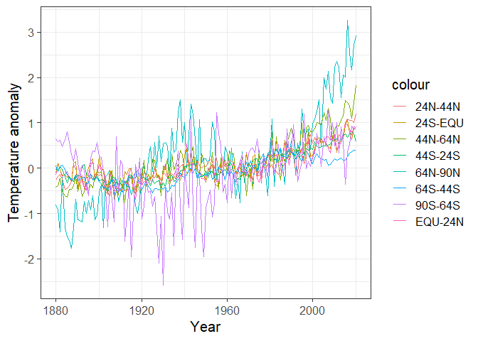
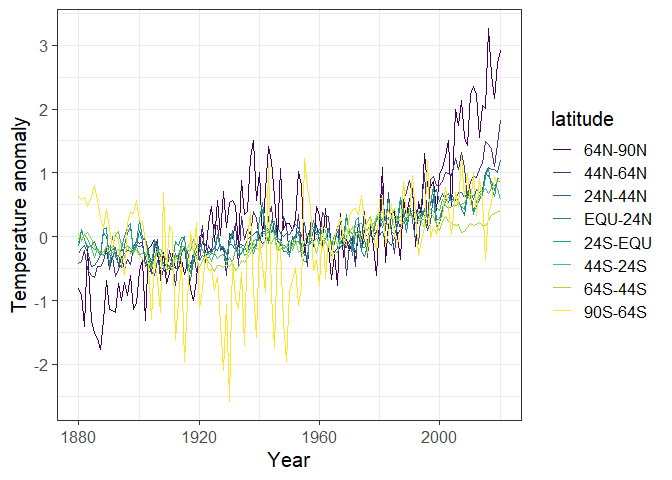
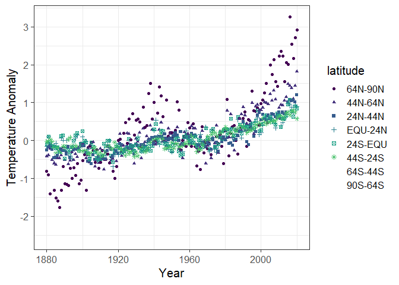
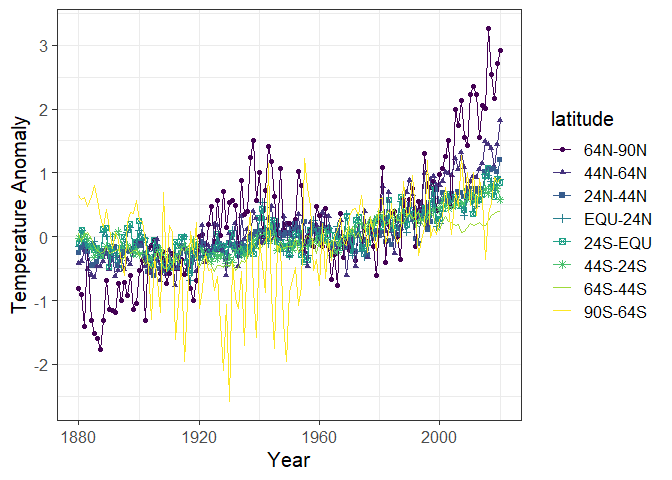
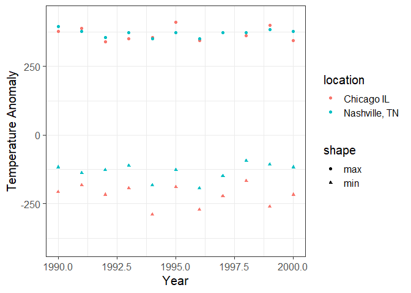
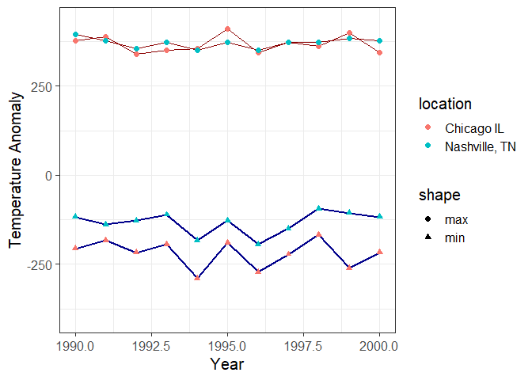
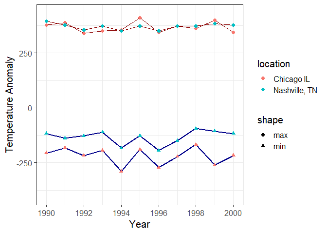
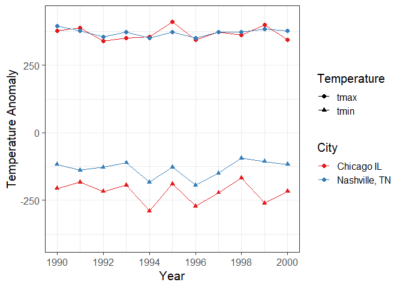

Data Wrangling with R
================
Jonathan Gilligan
Reading for Lab on Monday Feb. 1

-   [Introduction](#introduction)
    -   [R for Data Science](#r-for-data-science)
    -   [Online documentation for the
        tidyverse](#online-documentation-for-the-tidyverse)
-   [Data in R](#data-in-r)
    -   [Kinds of variables](#kinds-of-variables)
    -   [Vectors, Lists, Data Frames, and
        Tibbles.](#vectors-lists-data-frames-and-tibbles.)
        -   [Vectors](#vectors)
        -   [Lists](#lists)
        -   [Data frames and tibbles](#data-frames-and-tibbles)
-   [The Tidyverse](#the-tidyverse)
    -   [Manipulating `tibbles`](#manipulating-tibbles)
        -   [Manipulating Columns](#manipulating-columns)
        -   [Selecting Rows](#selecting-rows)
        -   [Summarizing rows](#summarizing-rows)
        -   [Combining Rows](#combining-rows)
    -   [Tidy Data and Pivoting
        tibbles](#tidy-data-and-pivoting-tibbles)
-   [Graphing Data](#graphing-data)

# Introduction

This is a brief introduction to data types, data structures, and some of
the functions and packages that we will use to manipulate data in the
labs.

There is a lot more, and two particular resources that I would recommend
to you are available free on the web.

## R for Data Science

The first resource is the book, [*R for Data
Science*](https://r4ds.had.co.nz), by Hadley Wickham who wrote most of
the `tidyverse` collection. You can buy a print version of the book from
all the usual online sources, but Wickham has also posted the full text
on the web at <http://r4ds.had.co.nz/> to make it available for free.
(Also, he wrote the whole book in RMarkdown, and if you’re curious you
can get the RMarkdown for the book from
<https://github.com/hadley/r4ds>).

The key parts of the book, from the perspective of the labs for this
course, are [Chapter 4: “Workflow
Basics,”](https://r4ds.had.co.nz/workflow-basics.html) which presents a
brief overview of R and how to program with it; [Chapter 5: “Data
Transformation,”](https://r4ds.had.co.nz/transform.html) which explains
the functions I discuss in the first part of this handout about tibbles
and the manipulating them with functions like `select`, `filter`,
`mutate`, and `summarize`; and [Chapter 3: “Data
Visualization,”](https://r4ds.had.co.nz/data-visualisation.html) which
describes using the `ggplot2` package to make graphs and charts of your
data. [Chapter 12, “Tidy Data”](https://r4ds.had.co.nz/tidy-data.html)
describes using the `pivot` functions to organize your data in ways that
make it easier to analyze.

If you are interested in learning more about R, Section II of the book
discusses the different data types that R uses in detail (tibbles,
character data (or strings), factors, dates, and times). Section III
discusses programming, and section IV discusses statistical modeling
(i.e., fitting functions to data). Section V discusses RMarkdown and all
the different ways you can use it to communicate about your analysis
with other people.

The book is an excellent introduction to data analysis with R. I have
recommended it to many people who did not previously have experience
working with programming or R and they found it a very accessible,
useful, and user-friendly introduction.

## Online documentation for the tidyverse

*R for Data Science* is a great introduction to the concepts behind the
`tidyverse` collection of packages and functions for R, but what should
you do when you already understand that big picture and just want to
know how to do a specific task? For that, the online documentation for
the `tidyverse` is very useful and you can find it at
<http://www.tidyverse.org/packages/>.

This page has links to the documentation for all the major tidyverse
packages: [`ggplot2`](https://ggplot2.tidyverse.org/) for making
graphics, [`dplyr`](https://dplyr.tidyverse.org/) and
[`tidyr`](https://tidyr.tidyverse.org/) for working with `data.frames`
and [`tibbles`](https://tibble.tidyverse.org/),
[`reader`](https://readr.tidyverse.org/) for reading in data from text
files and [`readxl`](https://readxl.tidyverse.org/) for reading data
from Excel spreadsheets, and many more packages that we will not be
using in these labs.

The documents give lots of examples showing what the functions do and
explanations of how to do many common tasks. Especially for
[`ggplot2`](https://ggplot2.tidyverse.org/), it can be very useful to
look at the graphs in the examples to find something that looks like
what you’re trying to do and then seeing the code that made that happen.

# Data in R

## Kinds of variables

R is capable of analyzing many different kinds of data. Some of the most
important kinds of data that we may work with are:

-   **Integer data**, which represents discrete quantities, such as
    counting events or objects.

-   **Real number data**, which represents quantities that can have
    fractional values. Most of the data we will work with in this
    course, such as temperatures, altitudes, amounts of rainfall, and so
    forth, will be real-number data. This kind of data is also referred
    to frequently as “floating point” data or (for obscure reasons
    having to do with computer hardware) as “double” or
    “double-precision” data.

-   **Character data**, which represents text. Examples include names of
    months, or categories (such as the name of a city or country). This
    kind of data is also referred to as “string data”.

-   **factor data**, which represents variables that can only take on
    certain discrete values. R treats factor data as a kind of augmented
    character data.

    The difference between character data and factor data is that factor
    data has an explicit set of allowed values and has an integer number
    associated with each of those values.

    For instance, if I have a factor variable with the allowed values
    “up” and “down”, then I could not assign it a value “left” or
    “right”, whereas a character variable can be assigned any arbitrary
    text, such as “second star to the right and straight on til
    morning.”

    There are two kinds of factors: ordered and unordered. The
    difference is that the legal values for ordered factors have a
    specific order, so you can say that one comes before or after
    another (or is greater than or less than another), whereas unordered
    factors don’t have any natural ordering.

    Examples of ordered variables might be the months of the year, or
    the days of the week, or a grouping like “small”, “medium”, “large”,
    or “bad”, “fair”, “good”.

    Examples of unordered variables might be lists of states, gender,
    religion, cities, sports teams, or other descriptive characteristics
    that don’t have a natural order to them.

-   **date and time data**, which represents calendar dates, times of
    day, or a combination, such as 9:37 PM on January 17, 1984.

For the most part, R handles different data types sensibly so you don’t
need to worry about them, but sometimes when R is reading data in from
files, or when you want to convert one kind of variable to another, you
will need to think about these.

The most common cases where you will need to think about this is when
you are reading data in from files. Sometimes it is ambiguous whether to
treat something from a file as character data, numerical data, or a
date. In such cases, you may need to give R guidance about how to
interpret data. The functions for reading data in from files, such as
`read_csv` and `read_table` allow you to specify whether a given column
of data in a table is integer, double-precision (floating point),
character, date, etc.

R also provides functions for converting data. The `as.character`
function takes data that might be character, factor, or numeric, and
represent it as text (characters).

`as.numeric` or `as.integer` will allow you to convert a character
variable to a number. For instance, `as.numeric("3.14")` converts a text
variable “3.14” into a numeric variable 3.14.

`as.integer` is very useful when we want to convert an ordered factor to
an integer that corresponds to the order of that value. For instance, if
I have an ordered factor `f` with legal values corresponding to the
months of the year (“Jan”, “Feb”, …, “Dec”), if `f` has the value `Mar`,
then `as.integer(f)` will have the integer value 3.

## Vectors, Lists, Data Frames, and Tibbles.

In statistics, you generally don’t just work with one number at a time,
but with collections of numbers. R provides many ways to work with
collections of numbers.

### Vectors

The simplest is a **vector**. A vector is a collection of values that
are all of the same kind: a collection of integers, a collection of
floating point values, a collection of character values, a collection of
factor values, etc.

You specify vectors like this: `x = c(1, 2, 5, 9, 3, 4, 2, 7, 5)`. You
can access elements of vectors by indexing their position within the
vector, so `x[3]` will be 5 and `x[4]` will be 9.

You can also give the elements of a vector names:
`ages = c(Sam = 27, Ben = 20, Sarah = 25, Deborah = 31)` allows you to
use `ages["Ben"]`, which will be 20.

All of the elements of a vector have to be the same kind, so
`x = c(1, 2, "three")` will not allow the vector to mix numbers and
characters and R will transform all of the values to character. The
result is `"1", "2", "three"`, and `x[1] + x[2]` will give an error
because R doesn’t know how to add two character variables. However,
`as.numeric(x[1]) + as.numeric(x[2])` will yield 3.

### Lists

Lists are a lot like vectors, but they can contain different kinds of
variables. They can even contain lists and vectors.
`x = list(1, 2, "three", list(4, 5, 6))` has four elements. The first
two are the numbers 1 and 2; the third is the character string “three”,
and the fourth is the list `(4,5,6)`.

Just as we can have named vectors, we can have named lists:
`ages = list(Sam = 27, Ben = 20, Sarah = 25, Deborah = 31)`. There is a
nice shortcut to getting the elements of a named list, using a dollar
sign: `ages$Sam` is 27.

### Data frames and tibbles

We will not use lists very much in this class. We will use vectors a
little bit, but what we will use *a lot* are tables of data. You have
probably worked a lot with spreadsheets and other data analysis tools
that organize data in a table with rows and columns. This is a very
natural and common way to work.

R provides a structure called a `data.frame` for working with tabular
data, but the package `tidyverse` introduces an improved version of the
`data.frame` called a `tibble` (think of it as a kind of data table).

`data.frames` and `tibbles` have rows and columns. A row represents a
set of quantities, such as measurements or observations, that go
together in some way. Different rows in a tibble represent different
sets of these quantities.

For instance, if I am measuring the height and weight of a number of
people, then I would have a row for each person and each row would have
a column for the person’s name or identity code, a column for their
height, and a column for their weight.

If I am measuring the average temperature and average precipitation for
a number of cities, then I would have a column for the city, a column
for the temperature, and a column for the precipitation.

Each column of a `data.frame` or `tibble` should correspond to a
specific kind of data (integer, floating point, character, factor, date,
etc.). A column is a kind of vector, so it has to obey the restrictions
that apply to vectors.

To get some experience with tibbles, let’s load a couple of data sets
that I have prepared. If you have cloned the directory for this document
(from <https://github.com/gilligan-ees-3310/lab_02_documentation>), you
can load the datasets, which contain daily weather summaries for
Nashville and Chicago, by running the code below:

``` r
nashville_weather = readRDS('_data/nashville_weather.Rds')
chicago_weather = readRDS('_data/chicago_weather.Rds')
```

Here is an example of the first few rows of a tibble with weather data
for Nashville from 1950–2020:

``` r
head(nashville_weather)
```

    ## # A tibble: 6 x 6
    ##   id          date        prcp  tmin  tmax location     
    ##   <chr>       <date>     <int> <int> <int> <chr>        
    ## 1 USW00013897 1950-01-01   104    89   117 Nashville, TN
    ## 2 USW00013897 1950-01-02   287   117   144 Nashville, TN
    ## 3 USW00013897 1950-01-03     0   144   189 Nashville, TN
    ## 4 USW00013897 1950-01-04   191     6   211 Nashville, TN
    ## 5 USW00013897 1950-01-05   572     0    44 Nashville, TN
    ## 6 USW00013897 1950-01-06   160   -17   167 Nashville, TN

There are 6 columns: the weather station ID for the Nashville Airport,
the date of the measurement, the daily precipitation (in millimeters),
the daily minimum and maximum temperatures (Celsius), and the name of
the location.

The tibble also shows the kind of variable that each column represents:
`id` and `location` are character data, `date` is Date data, and `prcp`,
`tmin`, and `tmax` are double-precision floating point data (i.e., real
numbers).

In some ways, a tibble or `data.frame` is like a names list of vectors,
where each vector is a column and its name is the name of the column. We
can access individual columns using the dollar sign, just as with
regular named lists:

``` r
precipitation = nashville_weather$prcp
```

And we can see what the result is:

``` r
head(precipitation)
```

    ## [1] 104 287   0 191 572 160

RStudio has a nice feature that lets you examine a tibble or
`data.frame` as though it were a spreadsheet. To examine one of R’s
built-in data sets, which has data on hurricanes in the Atlantic from
1975–2015: `View(dplyr::storms)`

Some other useful functions:

-   You can get a list of the names of a named vector, a named list, or
    the columns of a tibble or `data.frame` with the `names` function:
    `names(x)`, where x is a vector, list, tibble, or `data.frame`.

-   You can get the length of a vector or list with the `length`
    function, and you can get the number of rows and columns in a tibble
    using the `dim` function:

``` r
x = c(1, 2, 3, 4, 5)
print("Length of x is")
```

    ## [1] "Length of x is"

``` r
print(length(x))
```

    ## [1] 5

``` r
print("Dimensions of dplyr::storms is ")
```

    ## [1] "Dimensions of dplyr::storms is "

``` r
print(dim(dplyr::storms))
```

    ## [1] 10010    13

That’s 10010 rows and 13 columns. You can also get just the number of
rows or the number of columns with `nrow()` and `ncol()`.

# The Tidyverse

The “tidyverse” is a collection of packages written by Hadley Wickham to
make it easy to work with data frames. Wickham developed an improved
kind of data frame that has features that are lacking in the basic R
`data.frame`, and he developed a collection of tools for manipulating,
analyzing, and graphing data from tibbles and regular `data.frames`.

The tidyverse is explained in detail in the book, [*R for Data
Science*](https://r4ds.had.co.nz/), which you can read online at
<https://r4ds.had.co.nz/transform.html>.

To use the tidyverse, we need to load the package using R’s `library`
function. If tidyverse is not installed on your computer, you will get
an error message and you will have to run
`install.packages("tidyverse")` before you can proceed.

When you load `tidyverse`, it automatically loads a bunch of useful
packages for manipulating and analyzing data: `tibble`, `dplyr`,
`tidyr`, `purrr`, `readr`, and `ggplot2`.

If you have the `pacman` package installed, it can help you avoid these
error messages: after you load `pacman` with `library(pacman)`, then you
can load other packages using `p_load(tidyverse)` (you can substituate
any other package name for “tidyverse”): pacman will first see whether
you have that package on your computer; if you do, pacman will load it,
and if you don’t pacman will install the package from the Comprehensive
R Archive Network (CRAN) and then load it.

In the code below, I will also load the `lubridate` package, which is
part of `tidyverse` but is not loaded automatically when you load
`tidyverse`. `lubridate` provides useful functions for working with
dates, which will come in handy as we work with the weather data.

``` r
library(tidyverse)
library(lubridate)
# alternately, I could do the following:
# library(pacman)
# p_load(tidyverse, lubridate)
```

## Manipulating `tibbles`

One part of the `tidyverse` is the package `dplyr`, which has many
useful tools for modifying and manipulating tibbles:

-   `select` lets you choose a subset of columns from a tibble
-   `rename` lets you rename columns
-   `filter` lets you choose a subset of rows from a tibble
-   `arrange` lets you sort the rows with respect to the values of
    different columns
-   `mutate` lets you modify the values of columns or add new columns
-   `summarize` lets you generate summaries of columns (e.g., the mean,
    maximum, or minimum value of that column)
-   `group_by` and `ungroup` let you perform calculations with grouping
    (e.g., in combination with summarize, you can group by year to
    produce separate summaries for each year)
-   `bind_rows` to combine multiple tibbles that have the same kinds of
    columns by stacking one above the other.

There is a lot more, but these functions will be enough to keep us busy
for now and they will allow us to do some powerful analysis.

If you want to learn more about these functions, they are explained in
detail in [Chapter 5](https://r4ds.had.co.nz/transform.html) of *R for
Data Science*.

### Manipulating Columns

Let’s start with `select`: You can select columns to keep or columns to
delete.

Here are the first few rows of `nashville_weather`

``` r
head(nashville_weather)
```

    ## # A tibble: 6 x 6
    ##   id          date        prcp  tmin  tmax location     
    ##   <chr>       <date>     <int> <int> <int> <chr>        
    ## 1 USW00013897 1950-01-01   104    89   117 Nashville, TN
    ## 2 USW00013897 1950-01-02   287   117   144 Nashville, TN
    ## 3 USW00013897 1950-01-03     0   144   189 Nashville, TN
    ## 4 USW00013897 1950-01-04   191     6   211 Nashville, TN
    ## 5 USW00013897 1950-01-05   572     0    44 Nashville, TN
    ## 6 USW00013897 1950-01-06   160   -17   167 Nashville, TN

Let’s get rid of the `id` column, since we don’t really care about the
ID number, that meteorological agencies use to identify the weather
station. and let’s get rid of the `location` column because we know that
the data set is from Nashville, so having that information repeated on
each row is a waste of space. To do this, we just call select,
specifying the tibble or `data.frame` to operate on, and then give a
list of columns to eliminate, with a minus sign in front of each:

``` r
x = select(nashville_weather, -id, -location)
head(x)
```

    ## # A tibble: 6 x 4
    ##   date        prcp  tmin  tmax
    ##   <date>     <int> <int> <int>
    ## 1 1950-01-01   104    89   117
    ## 2 1950-01-02   287   117   144
    ## 3 1950-01-03     0   144   189
    ## 4 1950-01-04   191     6   211
    ## 5 1950-01-05   572     0    44
    ## 6 1950-01-06   160   -17   167

Alternately, instead of telling select which columns to get rid of, we
can tell it which columns to keep:

``` r
x = select(nashville_weather, date, prcp, tmin, tmax)
head(x)
```

    ## # A tibble: 6 x 4
    ##   date        prcp  tmin  tmax
    ##   <date>     <int> <int> <int>
    ## 1 1950-01-01   104    89   117
    ## 2 1950-01-02   287   117   144
    ## 3 1950-01-03     0   144   189
    ## 4 1950-01-04   191     6   211
    ## 5 1950-01-05   572     0    44
    ## 6 1950-01-06   160   -17   167

We can specify a range of consecutive columns by giving the first and
last with a colon between them:

``` r
x = select(nashville_weather, date:tmax)
head(x)
```

    ## # A tibble: 6 x 4
    ##   date        prcp  tmin  tmax
    ##   <date>     <int> <int> <int>
    ## 1 1950-01-01   104    89   117
    ## 2 1950-01-02   287   117   144
    ## 3 1950-01-03     0   144   189
    ## 4 1950-01-04   191     6   211
    ## 5 1950-01-05   572     0    44
    ## 6 1950-01-06   160   -17   167

This is a general R thing: we can specify a range of numbers in a
similar way:

``` r
1:10
```

    ##  [1]  1  2  3  4  5  6  7  8  9 10

`rename` lets us rename columns:

``` r
x = rename(nashville_weather, weather_station = id, city = location)
head(x)
```

    ## # A tibble: 6 x 6
    ##   weather_station date        prcp  tmin  tmax city         
    ##   <chr>           <date>     <int> <int> <int> <chr>        
    ## 1 USW00013897     1950-01-01   104    89   117 Nashville, TN
    ## 2 USW00013897     1950-01-02   287   117   144 Nashville, TN
    ## 3 USW00013897     1950-01-03     0   144   189 Nashville, TN
    ## 4 USW00013897     1950-01-04   191     6   211 Nashville, TN
    ## 5 USW00013897     1950-01-05   572     0    44 Nashville, TN
    ## 6 USW00013897     1950-01-06   160   -17   167 Nashville, TN

### Selecting Rows

`filter` lets us select only rows that match a condition:

``` r
x = filter(nashville_weather, year(date) > 2015 & tmax < 0)
head(x)
```

    ## # A tibble: 6 x 6
    ##   id          date        prcp  tmin  tmax location     
    ##   <chr>       <date>     <int> <int> <int> <chr>        
    ## 1 USW00013897 2016-01-18     0  -110   -38 Nashville, TN
    ## 2 USW00013897 2016-01-19     0   -99   -21 Nashville, TN
    ## 3 USW00013897 2016-01-23     0   -82   -10 Nashville, TN
    ## 4 USW00013897 2016-02-09    13   -60   -27 Nashville, TN
    ## 5 USW00013897 2016-02-10     5   -71    -5 Nashville, TN
    ## 6 USW00013897 2016-12-15     0   -60   -10 Nashville, TN

In the code above, I used the `year` function from the `lubridate`
package to extract just the year from a date.

One thing that is important to know about making comparisons in `filter`
expressions: to specify that two things are equal, you write `==` with
two equal signs. A single equal sign is for assigning a value to a
variable and two equal signs are for comparisons. You can also use
“&lt;=” for less than or equal to and “&gt;=” for greter than or equal
to.

``` r
x = filter(nashville_weather, date == ymd("2016-06-10"))
x
```

    ## # A tibble: 1 x 6
    ##   id          date        prcp  tmin  tmax location     
    ##   <chr>       <date>     <int> <int> <int> <chr>        
    ## 1 USW00013897 2016-06-10     0   156   333 Nashville, TN

In the code above, I used the `ymd` function from `lubridate` to
translate a character value “2016-06-10” to the date value for June 10,
2016.

You can combine conditions in `filter` by using `&` to indicate “and”
and `|` to indicate “or”.

We can sort the rows of a tibble or `data.frame` with the `arrange`
function:

``` r
x = arrange(nashville_weather, desc(tmax), tmin)
head(x,10)
```

    ## # A tibble: 10 x 6
    ##    id          date        prcp  tmin  tmax location     
    ##    <chr>       <date>     <int> <int> <int> <chr>        
    ##  1 USW00013897 2012-06-29     0   211   428 Nashville, TN
    ##  2 USW00013897 1952-07-27     0   200   417 Nashville, TN
    ##  3 USW00013897 1952-07-28     0   228   417 Nashville, TN
    ##  4 USW00013897 2012-06-30     0   267   417 Nashville, TN
    ##  5 USW00013897 1952-06-30   152   233   411 Nashville, TN
    ##  6 USW00013897 2007-08-16     0   244   411 Nashville, TN
    ##  7 USW00013897 2012-06-28     0   178   406 Nashville, TN
    ##  8 USW00013897 1988-07-08     0   200   406 Nashville, TN
    ##  9 USW00013897 1954-09-05     0   206   406 Nashville, TN
    ## 10 USW00013897 2012-07-06     0   222   406 Nashville, TN

This sorts the rows in descending order of `tmax` (i.e., so the largest
values are at the top), and where multiple rows have the same value of
`tmax`, then it sorts them in ascending order of `tmin`. Observe the
three rows with `tmax` = 41.7, the two rows where `tmax` = 41.1, and the
four rows where `tmax` = 40.6.

By default, `head` takes the first 6 rows of a tibble, but we can
override that, to return a different number of rows. Here, we told
`head` to return the first 10 rows of `x`.

If we want to change the values in a column, or create new columns, we
can use the `mutate` function. The weather data we have give
temperatures in Celsius and the precipitation in millimeters. Let’s
convert these to Fahrenheit and inches, respectively, and then let’s
create a `trange` column that will have the difference between the
maximum and minimum temperature.

There are 25.4 millimeters in an inch and we convert Celsius
temperatures to Fahrenheit using the equation

*T*<sub>Fahrenheit</sub> = (9/5)*T*<sub>Celsius</sub> + 32

``` r
x = mutate(nashville_weather, prcp = prcp / 25.4, tmin = tmin * 9./5. + 32,
           tmax = tmax * 9./5. + 32, trange = tmax - tmin)
head(x)
```

    ## # A tibble: 6 x 7
    ##   id          date        prcp   tmin  tmax location      trange
    ##   <chr>       <date>     <dbl>  <dbl> <dbl> <chr>          <dbl>
    ## 1 USW00013897 1950-01-01  4.09 192.    243. Nashville, TN   50.4
    ## 2 USW00013897 1950-01-02 11.3  243.    291. Nashville, TN   48.6
    ## 3 USW00013897 1950-01-03  0    291.    372. Nashville, TN   81  
    ## 4 USW00013897 1950-01-04  7.52  42.8   412. Nashville, TN  369  
    ## 5 USW00013897 1950-01-05 22.5   32     111. Nashville, TN   79.2
    ## 6 USW00013897 1950-01-06  6.30   1.40  333. Nashville, TN  331.

### Summarizing rows

Summaries are useful for finding averages and extreme values. Let’s find
the maximum and minimum temperatures and the most extreme rainfall in
the whole data set:

``` r
x = summarize(nashville_weather, prcp_max = max(prcp, na.rm = TRUE), 
              tmin_min = min(tmin, na.rm = TRUE), 
              tmax_max = max(tmax, na.rm = TRUE))
x
```

    ## # A tibble: 1 x 3
    ##   prcp_max tmin_min tmax_max
    ##      <int>    <int>    <int>
    ## 1     1842     -400      428

`nashville_weather` has 25932 rows, but summarize reduces it to a single
summary row.

**NOTE:** Here, the parameter `na.rm = TRUE` in `max` and `min` is a way
to tell R to ignore missing values when it calculates the maximum and
minimum values. Sometimes a data set will have missing values (for
instance, suppose the weather station was not working that day), and it
indicates these with a special value that appears as `NA`, meaning “not
available”. Normally, if you ask for the maximum, minimum, or mean value
of a data series with missing values, R will return `NA` because if some
values are missing, it doesn’t know what the actual maximum or minimum
is—the missing values could have been the largest or smallest. If you
want R to ignore missing values and return the maximum, minimum, or mean
value of the data that you do have, then you add the `na.rm = TRUE`
parameter when you call `max()`, `min()`, `mean()`, or other summary
functions.

You can use summary to generate multiple summary quantities from a
column:

``` r
x = summarize(nashville_weather, prcp_max = max(prcp), prcp_min = min(prcp))
x
```

    ## # A tibble: 1 x 2
    ##   prcp_max prcp_min
    ##      <int>    <int>
    ## 1     1842        0

We can also generate grouped summaries:

``` r
x = ungroup(summarize(group_by(nashville_weather, year(date)), 
                      prcp_max = max(prcp), prcp_tot = sum(prcp)))
head(x)
```

    ## # A tibble: 6 x 3
    ##   `year(date)` prcp_max prcp_tot
    ##          <dbl>    <int>    <int>
    ## 1         1950      846    16330
    ## 2         1951      973    14838
    ## 3         1952     1176    10113
    ## 4         1953      478    10502
    ## 5         1954      732    10862
    ## 6         1955      831    11539

This provides the maximum one-day precipitation and the total annual
precipitation for each year

Note how difficult it is to read that grouped summary expression: the
`group_by` function is inside `summarize`, which is inside `ungroup`.

The `tidyverse` offers us a much nicer way to put these kind of
complicated expressions together using what it calls the “pipe”
operator, `%>%`. The pipe operator chains operations together, taking
the result of the one on the left and inserting it into the one on the
right.

We can use the pipe operator to rewrite the expression above as

``` r
x = nashville_weather %>% group_by(year(date)) %>% summarize(prcp_max = max(prcp), prcp_tot = sum(prcp)) %>%
  ungroup()
head(x)
```

    ## # A tibble: 6 x 3
    ##   `year(date)` prcp_max prcp_tot
    ##          <dbl>    <int>    <int>
    ## 1         1950      846    16330
    ## 2         1951      973    14838
    ## 3         1952     1176    10113
    ## 4         1953      478    10502
    ## 5         1954      732    10862
    ## 6         1955      831    11539

Now the expression is easier to read: First we group `nashville_weather`
by year, then we summarize it by calculating the maximum daily
precipitation and the yearly total for each year, and finally, after we
summarize we ungroup.

You can combine any set of the `tidyverse` functions using the pipe
operator, so you could `select` columns, `filter` rows, `mutate` the
values of columns, and `summarize`, using the `%>%` pipe operator to
connect all of the different operations in sequence.

### Combining Rows

Another useful command is `bind_rows`, which lets us combine tibbles:

``` r
weather = bind_rows(nashville_weather, chicago_weather)
```

This creates a single tibble that has all of the rows from
`nashville_weather` on top and all the rows from `chicago_weather` on
the bottom. Because the two tibbles have the same columns, the columns
are matched up.

We can operate on this combined tibble:

``` r
weather_summary = weather %>% 
  mutate(year = year(date), t_range = tmax - tmin) %>%
  group_by(year, location) %>%   
  summarize(prcp_max = max(prcp), prcp_tot = sum(prcp), t_range.max = max(t_range)) %>%
  ungroup() %>%
  arrange(year, location)
tail(weather_summary)
```

    ## # A tibble: 6 x 5
    ##    year location      prcp_max prcp_tot t_range.max
    ##   <dbl> <chr>            <int>    <int>       <int>
    ## 1  2018 Chicago IL         686    11203         211
    ## 2  2018 Nashville, TN      683    14976         277
    ## 3  2019 Chicago IL         876    13698         211
    ## 4  2019 Nashville, TN     1016    16329         222
    ## 5  2020 Chicago IL          NA       NA          NA
    ## 6  2020 Nashville, TN      831    13323         222

## Tidy Data and Pivoting tibbles

The `tidyr` package in the tidyverse is used to make data `tidy`:
re-organizing the columns and rows of a `tibble` to make it easier to
analyze.

Sometimes you want to re-organize a data frame or tibble to collect many
columns into a single column, or we may want to separate one column of
data into many columns. These operations, which change the shape of the
data frame, are called “pivots”. Here, we will explore two powerful
functions in the tidyverse, `pivot_longer` and `pivot_wider`, and they
are explained in detail in [the section on
“Pivoting”](https://r4ds.had.co.nz/tidy-data.html#pivoting) in [chapter
12](https://r4ds.had.co.nz/tidy-data.html) of *R for Data Science*.

Consider this data frame, which was read in from a spreadsheet of global
temperatures produced at NASA:

``` r
giss_zonal <- readRDS('_data/giss_zonal.Rds')
head(giss_zonal)
```

    ## # A tibble: 6 x 9
    ##    year x64n_90n x44n_64n x24n_44n equ_24n x24s_equ x44s_24s x64s_44s x90s_64s
    ##   <int>    <dbl>    <dbl>    <dbl>   <dbl>    <dbl>    <dbl>    <dbl>    <dbl>
    ## 1  1880    -0.81    -0.42    -0.26   -0.16    -0.1     -0.02     0.05    0.65 
    ## 2  1881    -0.91    -0.39    -0.18    0.09     0.11    -0.04    -0.07    0.580
    ## 3  1882    -1.4     -0.22    -0.13   -0.05    -0.04     0.03     0.04    0.61 
    ## 4  1883    -0.19    -0.51    -0.23   -0.18    -0.15    -0.03     0.07    0.48 
    ## 5  1884    -1.31    -0.6     -0.46   -0.13    -0.16    -0.18    -0.02    0.63 
    ## 6  1885    -1.52    -0.64    -0.45   -0.07    -0.2     -0.33    -0.15    0.8

The tibble presents the average temperatures for different bands of
latitude: 64%deg;N–90°N, 44°N==64°N, 24°N–44°N, Equator–24°N, and the
same for the Southern Hemisphere.

If we wanted to plot all of these, we could do something like this:

``` r
ggplot(giss_zonal, aes(x = year)) + 
  geom_line(aes(y = x64n_90n, color = "64N-90N")) +
  geom_line(aes(y = x44n_64n, color = "44N-64N")) +
  geom_line(aes(y = x24n_44n, color = "24N-44N")) +
  geom_line(aes(y = equ_24n, color = "EQU-24N")) +
  geom_line(aes(y = x24s_equ, color = "24S-EQU")) +
  geom_line(aes(y = x44s_24s, color = "44S-24S")) +
  geom_line(aes(y = x64s_44s, color = "64S-44S")) +
  geom_line(aes(y = x90s_64s, color = "90S-64S")) +
  labs(x = "Year", y = "Temperature anomaly")
```

<!-- -->

This is a big mess. It would be hard to clean up the appearance, and
would require a lot of retyping if we decided to group the data into
different bands of latitude.

We can do this much more easily with the `pivot_longer` function:

``` r
bands = names(giss_zonal) # column names of the tibble
bands = bands[-1] # drop the first column ("year")
labels = c("64N-90N", "44N-64N", "24N-44N", "EQU-24N", 
           "24S-EQU", "44S-24S", "64S-44S", "90S-64S")
tidy_zonal = giss_zonal %>%
  pivot_longer(cols = -year, names_to = "latitude", values_to = "anomaly")
```

Let’s see what the result of this looks like:

``` r
head(tidy_zonal)
```

    ## # A tibble: 6 x 3
    ##    year latitude anomaly
    ##   <int> <chr>      <dbl>
    ## 1  1880 x64n_90n   -0.81
    ## 2  1880 x44n_64n   -0.42
    ## 3  1880 x24n_44n   -0.26
    ## 4  1880 equ_24n    -0.16
    ## 5  1880 x24s_equ   -0.1 
    ## 6  1880 x44s_24s   -0.02

Now we can clean up the `latitude` column a bit to make it more friendly
for human readers:

``` r
tidy_zonal = tidy_zonal %>%
  mutate(latitude = ordered(latitude, levels = bands, 
                            labels = labels)) %>%
  arrange(year, latitude)

head(tidy_zonal)
```

    ## # A tibble: 6 x 3
    ##    year latitude anomaly
    ##   <int> <ord>      <dbl>
    ## 1  1880 64N-90N    -0.81
    ## 2  1880 44N-64N    -0.42
    ## 3  1880 24N-44N    -0.26
    ## 4  1880 EQU-24N    -0.16
    ## 5  1880 24S-EQU    -0.1 
    ## 6  1880 44S-24S    -0.02

In this, the `mutate` command converts the latitude band into an ordered
factor where the order is the order of the original columns. This gets R
to sort them in the order of latitude bands, instead of alphabetically,
when it makes the legend for the plot. The `labels` parameter then
changes the names from the original column name, which was somewhat
cryptic, to something a person can make sense of.

Now let’s plot it:

``` r
ggplot(tidy_zonal, aes(x = year, y = anomaly, color = latitude)) +
  geom_line() +
  labs(x = "Year", y = "Temperature anomaly")
```

<!-- -->

The code for making the plot was a lot simpler, and by using an ordered
factor, we could control the order of the latitude bands in the legend,
which now appear in a sensible order. It is much easier to look at this
graph and quickly recognize that the far northern latitudes (64N–90N,
and to a lesser extent 44N–64N) are warming up much faster than the rest
of the planet.

Back in 1967, one of the first global climate models predicted that
global warming due to greenhouse gases would cause the far northern
latitudes to warm up much faster than the rest of the planet. This data
confirms that prediction.

We also see that the Southern Hemisphere has warmed much less than the
Northern. Think about why that might be.

The `pivot_wider` function is the inverse of `pivot_longer`. It pivots a
tibble by spreading one column of data into many columns, using a second
column to indicate the names of those columns. For each row, the data in
the “value” column is moved to a new column named by the “key” column.

Let’s go back to the `weather_summary` tibble we made above:

``` r
head(weather_summary)
```

    ## # A tibble: 6 x 5
    ##    year location      prcp_max prcp_tot t_range.max
    ##   <dbl> <chr>            <int>    <int>       <int>
    ## 1  1950 Chicago IL         630    10105         244
    ## 2  1950 Nashville, TN      846    16330         244
    ## 3  1951 Chicago IL         721    10970         233
    ## 4  1951 Nashville, TN      973    14838         233
    ## 5  1952 Chicago IL         406     7188         217
    ## 6  1952 Nashville, TN     1176    10113         239

Let’s set it up to make it easy to compare the annual precipitation of
Nashville and Chicago:

``` r
x = weather_summary %>% select(year, location, prcp_tot) %>%
  pivot_wider(names_from = "location", values_from = "prcp_tot")
tail(x)
```

    ## # A tibble: 6 x 3
    ##    year `Chicago IL` `Nashville, TN`
    ##   <dbl>        <int>           <int>
    ## 1  2015        11688           12907
    ## 2  2016        10667           10861
    ## 3  2017        11599           13446
    ## 4  2018        11203           14976
    ## 5  2019        13698           16329
    ## 6  2020           NA           13323

# Graphing Data

Here, we will look at the `ggplot2` package for plotting data. This
package is automatically loaded when you load the `tidyverse` collection
with `library(tidyverse)`. It follows a theory of making useful graphs
of data called, “The Grammar of Graphics” (that’s where the “gg” comes
from).

The idea is that a graph has several distinct parts, which come
together:

-   One or more *layers* of graphics. A layer consists of the following:
    -   A *data table* with one or more columns, each corresponding to a
        different variable,
    -   A *mapping* of different variables (columns) in the data table
        to different, *aesthetics* of the plot. Aesthetics are things
        like
        -   the *x* coordinate,
        -   the *y* coordinate,
        -   the *color* of the point or line,
        -   the *fill* color that is used to fill in areas, like the
            interior of a rectangle or circle.
        -   the *shape* of points (e.g., circle, square, triangle,
            cross, diamond, …)
        -   the *size* of points and lines
        -   the *linetype* (e.g., solid, dashed, dotted, …)
        -   and so forth …
    -   A *geometry* (point, line, box, etc.) that is used to draw the
        data
-   A coordinate system (axes and legends)

There are some more aspects to the gramar of graphics, but we don’t need
them for what we’re going to do.

These graphics functions are explained in detail in [Chapter
3](https://r4ds.had.co.nz/data-visualisation.html) of *R for Data
Science*.

A simple graph has just one layer:

``` r
ggplot(data = tidy_zonal, # the data
       # the mapping of variables to aesthetics
       mapping = aes(x = year, y = anomaly, color = latitude, shape = latitude)
       ) +
  geom_point() + # the geometry
  labs(x = "Year", y = "Temperature Anomaly") # labels for the coordinates
```

<!-- -->

We can also make a plot with the same data, but two layers:

``` r
ggplot(data = tidy_zonal, # the data
       # the mapping of variables to aesthetics
       mapping = aes(x = year, y = anomaly, color = latitude, shape = latitude)
       ) +
  geom_point() + # the geometry of the first layer
  geom_line() +  # the geometry of the second layer
  labs(x = "Year", y = "Temperature Anomaly") # labels for the coordinates
```

<!-- -->

We can also use different mappings for different layers

``` r
annual_extremes = weather %>% mutate(year = year(date)) %>%
  group_by(location, year) %>% 
  summarize(tmin = min(tmin, na.rm = T),      # the na.rm = T means to ignore 
            tmax = max(tmax, na.rm = T)) %>%  # missing values if we don't put 
  ungroup()                                   # that in, then  if any year has
                                              # a missing value for even one 
                                              # day, the tmax or tmin for that 
                                              # year will be recorded as  
                                              # NA (missing)

ggplot(annual_extremes,                       # The data
       aes(x = year, color = location) ) +    # Shared aesthetics go here
                                              #
  geom_point(aes(y = tmin, shape = "min")) +  # Aesthetics that are different 
  geom_point(aes(y = tmax, shape = "max")) +  # for different geometrries go 
                                              # with the geometry.
                                              # 
  xlim(1990,2000) +                           # Set the range of the x-axis, 
                                              # part of the coordinate 
                                              # specification
                                              # 
  labs(x = "Year", y = "Temperature Anomaly") # labels for the coordinates
```

<!-- -->

Note that `ggplot` issued several harmless warnings to tell us that
setting the limits of the *x*-axis the way we did cause some points not
to be plotted. We can tell RMarkdown not to include those warnings in
the document by adding “warning=FALSE” to the options for the chunk

If we want to specify aesthetics as having fixed values, we can specify
them outside of the mapping. Here I specify the size and color of lines:

``` r
ggplot(data = annual_extremes) +
  geom_line(aes(x = year, y = tmin, group = location), 
            color = "dark blue", size = 1) +
  geom_line(aes(x = year, y = tmax, group = location), 
            color = "dark red", size = 0.3) +
  geom_point(aes(x = year, y = tmin, color = location, shape = "min"), 
             size = 2) +
  geom_point(aes(x = year, y = tmax, color = location, shape = "max"), 
             size = 2) +
  xlim(1990,2000) + # set the range of the x-axis, 
                    # part of the coordinate specification
  labs(x = "Year", y = "Temperature Anomaly") # labels for the coordinates
```

<!-- -->

We can also take finer control of the axis formatting:

``` r
ggplot(data = annual_extremes) +
  geom_line(aes(x = year, y = tmin, group = location), 
            color = "dark blue", size = 1) +
  geom_line(aes(x = year, y = tmax, group = location), 
            color = "dark red", size = 0.3) +
  geom_point(aes(x = year, y = tmin, color = location, shape = "min"), 
             size = 2) +
  geom_point(aes(x = year, y = tmax, color = location, shape = "max"), 
             size = 2) +
  scale_x_continuous(limits=c(1990,2000), 
                     breaks = c(1990, 1992, 1994, 1996, 1998, 2000)) + 
  # ^^^ the "breaks" parameter for an axis tells R where to put the labels
  labs(x = "Year", y = "Temperature Anomaly") # labels for the coordinates
```

<!-- -->

And, of course, we could use `pivot_longer` to simplify this graph:

``` r
annual_extremes_tidy = annual_extremes %>%
  pivot_longer(cols = -c(year, location), names_to = "Temperature", 
               values_to = "value")

ggplot(data = annual_extremes_tidy,                   # the data
       aes(x = year, y = value, color = location)) +  # the aesthetics
  geom_line(aes(size = Temperature)) +                # for lines, the size
                                                      # varies with Temperature
  geom_point(aes(shape = Temperature), size = 2) +    # for points, the shape
                                                      # varies with Temperature
  scale_size_manual(values = c(tmax = 0.5, 
                               tmin = 0.1)) + # set coordinates for "size"
  scale_x_continuous(limits=c(1990,2000), 
                     breaks = c(1990, 1992, 1994, 1996, 1998, 2000)) + 
  # ^^^ Set coordinates for the x-axis.
  scale_color_brewer(palette = "Set1", name = "City") + 
  # We can override the default color palette. 
  # The Brewer palettes are very good for people with color-blindness.
  labs(x = "Year", y = "Temperature Anomaly") # labels for the coordinates
```

<!-- -->
